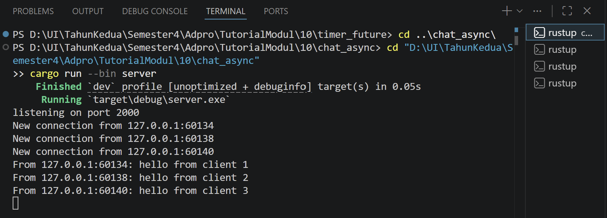
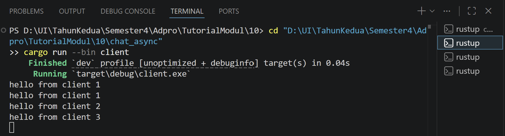
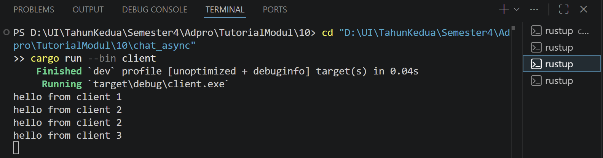
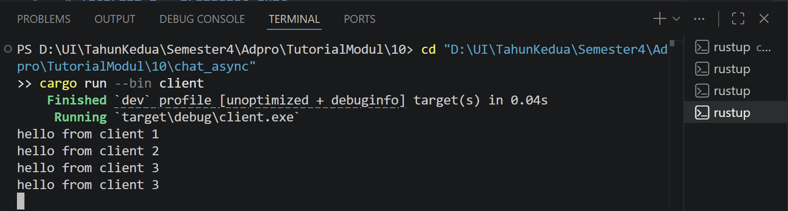

# Tutorial 2 - Broadcast Chat

## Experiment 2.1: Original code, and how it run

Project ini berisi aplikasi broadcast chat asynchronous berbasis WebSocket dari Comprehensive Rust.
Server menerima koneksi client pada `127.0.0.1:2000`.
Setiap client membaca input dari terminal, mengirim pesan tersebut ke server, lalu server melakukan broadcast pesan ke semua client yang sedang terhubung.

Cara menjalankan server:

```powershell
cargo run --bin server
```

Cara menjalankan client:

```powershell
cargo run --bin client
```

Untuk eksperimen, jalankan satu terminal server dan tiga terminal client.
Setelah semua client terhubung, ketik pesan pada salah satu client.
Pesan tersebut akan dikirim ke server melalui WebSocket, lalu server membroadcast pesan itu ke semua client.

### Server



Server berhasil berjalan pada port `2000`.
Pada screenshot, server menerima tiga koneksi client dari alamat lokal `127.0.0.1` dengan port yang berbeda-beda.
Server juga menerima tiga pesan, yaitu `hello from client 1`, `hello from client 2`, dan `hello from client 3`.

### Client 1



### Client 2



### Client 3



Setiap client menerima pesan dari client lain melalui broadcast server.
Pada terminal client, pesan yang diketik oleh client dapat terlihat dua kali: pertama sebagai input yang diketik di terminal, dan kedua sebagai pesan broadcast yang dikirim kembali oleh server.
Hal tersebut menunjukkan bahwa server juga mengirimkan pesan kembali ke pengirim, bukan hanya ke client lain.

Aplikasi ini menggunakan `tokio::select!` agar client dapat membaca input pengguna dan menerima pesan dari server secara concurrent.
Pada sisi server, `tokio::select!` juga digunakan untuk menangani dua pekerjaan sekaligus, yaitu menerima pesan dari satu client dan mengirim pesan broadcast ke client tersebut.
Ketika sebuah client mengirim pesan, server menerima pesan tersebut melalui WebSocket dan meneruskannya ke broadcast channel.
Setiap koneksi client memiliki receiver broadcast sendiri, sehingga semua client yang subscribe ke channel tersebut dapat menerima pesan yang sama.
Karena itu, ketika satu client mengetik pesan, pesan tersebut muncul pada semua client yang sedang terhubung.
